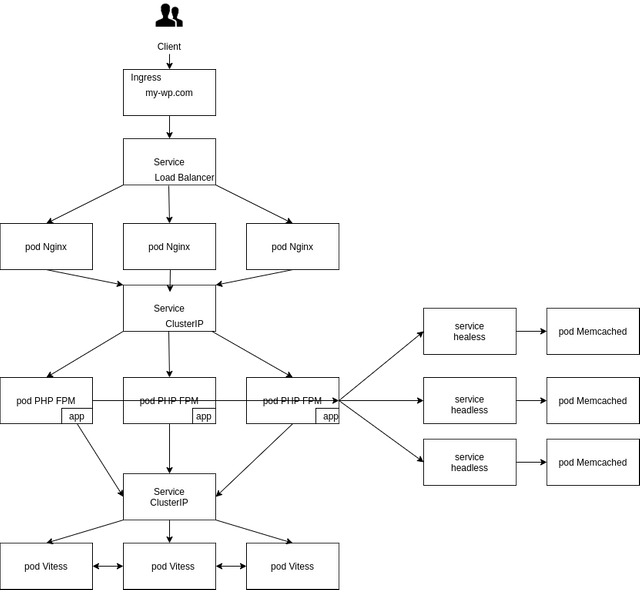

# SPE-xKUBE

Pour réaliser ce projet, vous aurez besoin de constituer plusieurs composants :

- Un cluster de pool PHP FPM en PHP 7.*
- Un cluster serveur web Nginx
- Un cluster de base de données Vitess (Connexions vers un site externe.)
- Un cluster memcached pour partager les sessions des utilisateurs. ( géré par PHP ).
- Les variables confidentiels, et les variables générique seront stockés dans des secrets et des configmap.
- Implémenter memcached avec mcrouter pour gérer les sessions.

Il n’y aura pas de Helm Chart qui répondront à l’ensemble des choses demandées, créez le votre, vous pouvez faire appels à des charts en dépendance.

- Certains dossiers devront être partagé à la fois par votre serveur web mais également par vos pools FPM. ( stockage persistant RWM : https://kubernetes.io/docs/concepts/storage/persistent-volumes/#access-modes (Connexions vers un site externe.)).
 
Accéder à votre application depuis l’extérieur : 

- Depuis un ingress ( au choix istio, nginx-ingress … )
 
Barême ( groupe de deux autorisés )

- Cluster PHP-FPM ( 2 points )
- Cluster serveur web Nginx ( 2 points )
- Connexion entre vos pools FPM et Nginx ( 2 points )
- Cluster Vitess ( 2 points )
- Connexion entre Vitess et Wordpress ( 1 points )
- Secret et configMap ( 1 points )
- Ingress solution ( 2 points )
- Ingress sur votre application ( 1 points )
- https sur votre application ( 1 points )
- Implémenter memcached avec mcrouter pour gérer les sessions. ( 3 points )
- Helm Chart par vos soins( 3 points )

Bonus :

- Logging / Monitoring ( 2 points )
- CI / CD ( 2 points )
- Varnish pour mettre en cache le front ( 2 points )