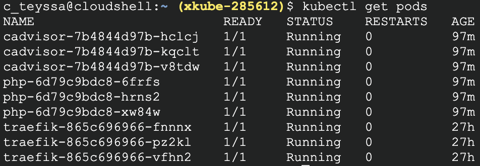

# SPE-xKUBE

Pour réaliser ce projet, vous aurez besoin de constituer plusieurs composants :

- Un cluster de pool PHP FPM en PHP 7.*
- Un cluster serveur web Nginx
- Un cluster de base de données Vitess (Connexions vers un site externe.)
- Un cluster memcached pour partager les sessions des utilisateurs. ( géré par PHP ).
- Les variables confidentiels, et les variables générique seront stockés dans des secrets et des configmap.
- Implémenter memcached avec mcrouter pour gérer les sessions.

Il n’y aura pas de Helm Chart qui répondront à l’ensemble des choses demandées, créez le votre, vous pouvez faire appels à des charts en dépendance.

- Certains dossiers devront être partagé à la fois par votre serveur web mais également par vos pools FPM. ( stockage persistant RWM : https://kubernetes.io/docs/concepts/storage/persistent-volumes/#access-modes (Connexions vers un site externe.)).
 
Accéder à votre application depuis l’extérieur : 

- Depuis un ingress ( au choix istio, nginx-ingress … )
 
Barême ( groupe de deux autorisés )

- Cluster PHP-FPM ( 2 points )
    - 
- Cluster serveur web Nginx ( 2 points )
    - Cluster Nginx remplacé par le reverse proxy Traefik, qui se charge de rediriger les requêtes en backend
    - 
- Connexion entre vos pools FPM et Nginx ( 2 points )
    - Les pods FPM ont reliés à Traefik via un router
- Ingress solution ( 2 points )
    - Ingress via Traefik
- Ingress sur votre application ( 1 points )
    - Ingress via Traefik
- https sur votre application ( 1 points )
    - HTTPS géré via Traefik
    - 
- Helm Chart par vos soins( 3 points )
    - Helm fonctionnel (sans la gestion des values)

Bonus :

- Logging / Monitoring ( 2 points )
    - Cadvisor sert à monitorer l'utilisation des ressources sur les pods
    - 
    - 

Le projet a été réalisé sur GoogleCloudPlatform, avec un DNS m'appartenant. Il ne sera plus accessible en ligne après le rendu du projet pour éviter les sur-coûts liés au Cloud.
